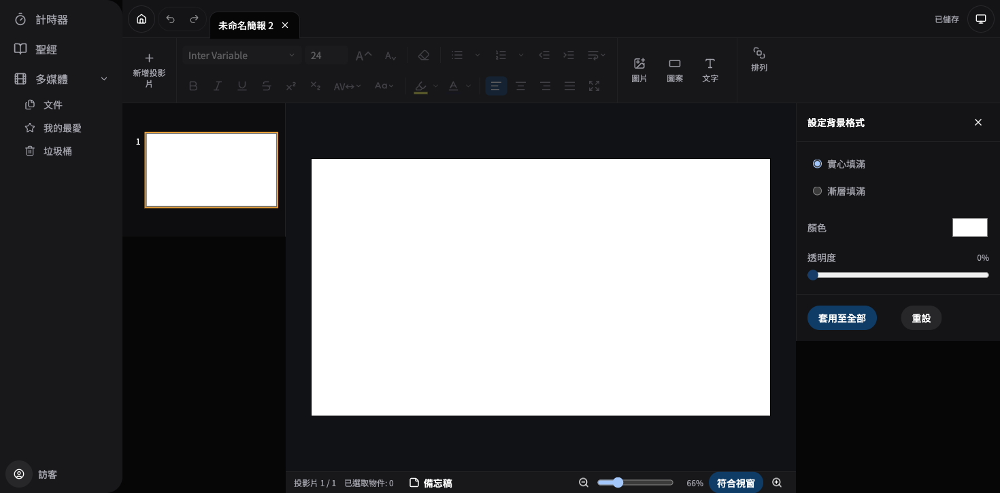

# Presenter UI / Editor Follow-up — Local Implementation

## Scope and environment

- Branch: `fix/ui-editor-follow-up`, isolated worktree `.worktrees/ui-editor-follow-up`.
- Base: latest fetched `origin/main` at execution start, `db2d2851` (2.4.3).
- All 19 accepted requirements implemented. No dependency or document-format migration added.
- Existing installed 2.4.3 app was not replaced. This report covers local source, production renderer build, browser tests, and Electron runtime smoke.
- Original checkout, untracked plans, and other worktrees were preserved.

## Causes and changes

| IDs              | Cause                                                                                                                  | Implemented behavior                                                                                                                                                      |
| ---------------- | ---------------------------------------------------------------------------------------------------------------------- | ------------------------------------------------------------------------------------------------------------------------------------------------------------------------- |
| U1               | Avatar fallback always rendered the guest icon                                                                         | Website-compatible name initials; guest icon retained.                                                                                                                    |
| U2               | Empty Modal.Trigger elements occupied document flow                                                                    | Removed unused triggers. About, Shortcuts and Preferences keep account coordinates within 1 px.                                                                           |
| U3               | Existing menu sections had no visible separators                                                                       | FAB has folder / create-upload / sync sections with separators.                                                                                                           |
| U4               | Overlay outside interaction ignored right-click; custom menus could immediately reopen underneath                      | Common Dropdown/Popover dismissal and custom ContextMenu consume the first outside contextmenu. Native text-editing menus are preserved.                                  |
| M1               | Date group order reused item sortDir; projection candidates spanned all groups                                         | Separate groupSortDir with version 4 migration; all projection entry points resolve one date group. Header subscribes to display, timezone and custom-order changes.      |
| E1, E6           | HeroUI v2 primary tokens were absent from v3 CSS; selectors lacked disabled styling                                    | Valid accent tokens, visible selected/mixed states, disabled font controls.                                                                                               |
| E2, E7           | Selection ring used an invalid token; divider appeared on hover                                                        | Orange selection ring, permanent contrasting border, dual border for mixed/image backgrounds; click-only 600 ms blink with reduced-motion support.                        |
| E3               | Sidebar buttons were stopped by the global action-control guard; no delete menu entry                                  | Delete/Backspace and right-click deletion share existing multi-slide commands and Undo; at least one slide remains.                                                       |
| E4               | Store next() returned at isEnded without closing the projection session                                                | Shared next action routes keyboard, navigation, preview and next-item actions to the workspace exit transaction.                                                          |
| E5, E8, E13, E14 | Image handles used an invalid fill token; drag clamped only negative positions; nudge clamped all edges                | Image eight handles, content-height text six handles, four-direction movement beyond bounds, default/Shift/Alt nudge 5/10/1. Negative coordinates survive save/reload.    |
| E9               | 250 ms writes, unconditional cover generation, broad measurement effect dependencies, unbounded continuous text drafts | 1,000 ms trailing save / 5,000 ms max wait, serialized latest pending revision, safe 4-second text draft boundaries, cover-only invalidation and stable layout callbacks. |
| E10, E12         | Fixed 720 px text section and ten always-visible arrangement buttons                                                   | Natural toolbar width, grouped Arrange menu, outlined Home and grouped Undo/Redo. Home and Timer settings both measured x=188, y=8, 40×40 in the same viewport.           |
| E11              | Reset reused deck default; background labels remained English                                                          | Reset restores current slide to global factory default. Apply to All updates existing slides and deck default. en / zh-TW / zh-CN labels completed.                       |

## Fixed performance workload

Production Chromium renderer, viewport 1440×900, fixed-seed local images, 10/100 slides with three text elements each and five shared image assets totaling approximately 5 MiB. Each case ran five times before and five times after the changes. Workload: 10 seconds typing, 3 seconds arrow movement, 20 non-cover note edits, cover text and movement, zoom, Undo/Redo, reload and content verification.

Values below are median / p95 across five runs. With five samples, reported p95 is the maximum observed run, not a population-level guarantee.

| Metric per workload                    | 10 slides before → after          | 100 slides before → after         |
| -------------------------------------- | --------------------------------- | --------------------------------- |
| Source writes                          | 22 / 22 → 5 / 5                   | 22 / 22 → 5 / 5                   |
| Cover thumbnail writes                 | 22 / 22 → 1 / 1                   | 22 / 22 → 1 / 1                   |
| Serialized MiB, aggregate              | 140.75 / 140.75 → 31.99 / 31.99   | 143.10 / 143.10 → 32.52 / 32.52   |
| JSON.stringify total ms                | 165.60 / 172.50 → 24.50 / 28.80   | 168.50 / 172.90 → 23.60 / 24.20   |
| DOM text measurements                  | 1149 / 1158 → 211 / 213           | 1152 / 1152 → 213 / 213           |
| Main-thread tasks ≥50 ms               | 18 / 20 → 1 / 2                   | 19 / 21 → 1 / 1                   |
| Final action to durable completion, ms | 329.20 / 333.90 → 206.70 / 336.60 | 333.60 / 338.80 → 156.20 / 221.70 |

[Raw runs and summary](2026-09-06-ui-editor-follow-up-performance.json).

The final-action latency includes the workload's Undo/Redo flush behavior; it is not the general autosave debounce duration. The coordinator tests separately verify idle delay, continuous-edit max wait, in-flight coalescing, retry, flush and discard. Layout instrumentation counts measurement DOM clones, not React commits or INP. No performance claim is made beyond this fixture and host.

The source still serializes the full document and inline image data. Each source write remains O(document size); this change reduces frequency and redundant derived work. Asset externalization would require a separate persistence/export/projection migration. IME composition may extend the scheduling target until compositionend; actual storage latency is not hard-bounded.

## Verification

- Vitest: 260 files / 3,107 tests passed, including failure/retry/discard, IME, grouped projection, migration, global/deck defaults and editor geometry.
- Production build/typecheck and bundle budget passed: precache 4.86/5 MiB; fonts 8.41/10 MiB; largest JS 2.11/2.25 MiB.
- Browser regressions: 8 new tests plus 4 existing responsive/resize/touch tests passed. Coverage: dialog positions, outside right-click, selected/mixed/disabled styles, text six handles, delete/Undo, image eight handles, negative coordinates/reload, and actual projection-tab close.
- Performance workload: all 20 before/after runs passed reload content checks.
- Electron: current built main/preload/renderer with the existing development Electron executable and a temporary user-data directory. A real local PNG was projected; end-screen next closed the actual projection BrowserWindow, returned to Files, and left one main window. Temporary test process/profile cleanup is explicit.
- Manual Chromium smoke: dark theme, orange thumbnail outline, compact Arrange control, exact Home alignment and Traditional Chinese background labels.

## Remaining delivery gates

No PR/remote CI, merge, release, signed package installation, or Windows physical-device smoke has been performed. Local Electron smoke is not installed-package or Windows acceptance. Keep the worktree and branch for review and these later delivery gates.
